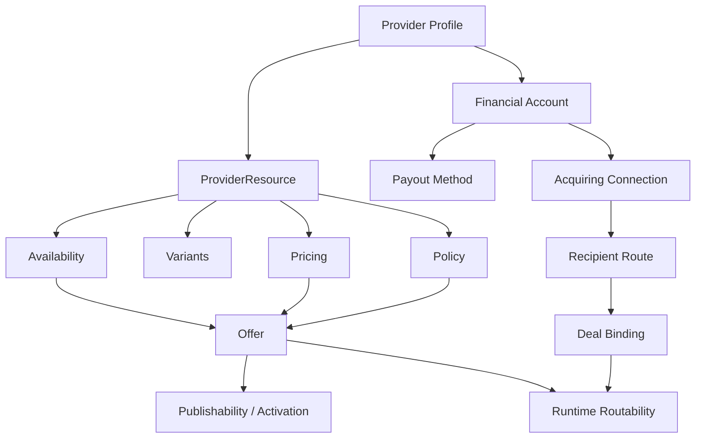

# Provider Console API Surface V1

## Purpose

This document defines the first-pass provider-facing API surface for Sportgearhub.

It answers:

- what the provider console API should expose
- how provider operations map to platform-specific domains
- which provider actions should be query-style versus command-style
- what constraints the provider API must enforce

## Core Principle

> Provider console API should reflect resource-first operating truth, not just offer CRUD.

This means:

- providers primarily manage `ProviderResource` and adjacent execution configuration
- `Offer` authoring is layered on top of resource, availability, pricing, variant, and policy setup
- provider API must never bypass capability, publishability, or routing rules

## Scope

The V1 provider console API covers:

- provider profile and operating state
- resource management
- variant management
- availability configuration
- pricing configuration
- policy configuration
- offer authoring and publication
- provider booking operations and fulfillment-facing updates

Implementation note:

- provider console endpoints live under `src/EbashIT.Sportgearhub.Api/Endpoints/ProviderConsole/`
- provider console routes still use `/api/v1/provider/...`
- folder structure expresses API surface ownership; route strings express external contract stability

The V1 provider console API does not cover:

- internal reconciliation tooling
- ledger internals
- platform canonicalization governance approval
- direct booking workflow mutation

## Provider API Families

### 1. Provider Profile API

Used for:

- provider identity
- operational profile
- readiness and status visibility

### 2. Resource API

Used for:

- create/update/archive provider resources
- inspect execution readiness

### 3. Variant API

Used for:

- define and manage rental variants
- configure variant exposure readiness

### 4. Availability API

Used for:

- availability profiles
- resource slots
- calendars
- blackout/exception management

### 5. Pricing API

Used for:

- pricing policies
- pricing summary generation status

### 6. Policy API

Used for:

- provider policy profiles
- resource/offer overrides
- visible policy summary preview

### 7. Offer API

Used for:

- offer drafts
- offer updates
- offer marketplace visibility windows
- offer setup readiness checklist
- publishability check
- activate/deactivate/archive

### 8. Provider Booking Operations API

Used for:

- list provider bookings
- view provider-facing booking details
- fulfillment progress or completion actions where allowed

### 9. Provider Routability API

Used for:

- inspect runtime routability of provider offers
- inspect resource-level impact on downstream execution readiness
- distinguish active commercial state from safe booking-path entry

### 10. Provider Fulfillment API

Used for:

- handover / pickup confirmation
- return / check-in confirmation
- final completion after operational fulfillment milestones

### 11. Provider Acquiring Connection API

Used for:

- financial setup readiness
- payout method drafts and review status
- T-Bank connection state
- acquiring onboarding submission
- routeability diagnostics for checkout and payout readiness
- visibility into recipient-route and deal-binding readiness

### 12. Provider Member Management API

Used for:

- owner-managed provider staff access
- invite by email and provider membership role
- list current provider members
- list provider invitations with sender, sent time, expiry, and acceptance metadata
- change member role
- remove provider access

Implemented endpoints:

- `GET /api/v1/provider/providers/{providerId}/members`
- `GET /api/v1/provider/providers/{providerId}/members/options`
- `POST /api/v1/provider/providers/{providerId}/members/invitations`
- `GET /api/v1/provider/providers/{providerId}/members/invitations`
- `PUT /api/v1/provider/providers/{providerId}/members/{membershipId}/role`
- `DELETE /api/v1/provider/providers/{providerId}/members/{membershipId}`

Rules:

- all provider member-management endpoints require the authenticated actor to be an owner of the target provider
- request role values are stable strings: `owner`, `manager`, `staff`, `finance`
- member options return API-owned role values with RU labels and descriptions for frontend select controls
- invitation records are persisted auth/access facts; the email token is only the delivery and acceptance command carrier
- member role changes and removals keep at least one owner membership for the provider
- provider member management changes only provider access; it does not change provider profile, resource, offer, booking, payment, or ledger truth

## Mermaid Provider Console View



## Query And Command Pattern

## Authorization And Provider Onboarding Entry

Provider registration starts from the normal user identity surface, not from a separate provider auth system.

- customer/web client receives `public_api`
- provider console receives `provider_api`
- web admin console receives `internal_api`
- provider console routes require a provider-scoped user after onboarding is approved and creates a `ProviderMembership`
- local email/password sign-in uses the OIDC password grant on `POST /api/v1/auth/login` or `POST /connect/token`
- frontend apps must store the returned access token and call scoped APIs with `Authorization: Bearer <access_token>`

Pre-provider onboarding routes:

- `POST /api/v1/provider-onboarding/current`
- `GET /api/v1/provider-onboarding/current`
- `PATCH /api/v1/provider-onboarding/current/profile`
- `POST /api/v1/provider-onboarding/current/submit`
- `GET /api/v1/provider-onboarding/legal-identity/ru/lookup?taxNumber={inn}&branchNumber={kpp?}`
- `GET /api/v1/addresses/ru/suggestions?query={address}&count={count?}`
- `POST /api/v1/addresses/ru/geolocate`

`GET /api/v1/provider-onboarding/current` returns an explicit `not_started` state with `applicationId: null`
when the signed-in user has no onboarding application yet. Frontends must use this onboarding state for
onboarding routing. Provider access selection belongs to `GET /api/v1/auth/provider-memberships`; `/api/v1/auth/me`
is identity/session only.

Flow:

- user signs in as a normal user
- user starts provider onboarding with public-authenticated identity
- API creates or updates a `ProviderOnboardingApplication`
- onboarding captures RU legal identity: `legalCountryCode`, `legalForm`, `taxNumber`, `registrationNumber`, `branchNumber`, `registeredAddress`
- optional DaData enrichment can prefill RU legal identity by INN before submit
- optional DaData address suggestions can help fill `registeredAddress` or the simple provider profile `address`
- internal review approves the application
- approval creates the `Provider`
- approval creates `ProviderMembership` with role `owner`
- provider-console access is available only after the user receives/refreshes a provider-console token with `provider_api`

Address suggestions are a global API helper projection, not provider-onboarding state. They do not create or mutate
onboarding applications, and they do not replace the submitted onboarding draft as the reviewed source of truth.

Reverse address geocoding is also a global API helper projection. It finds nearby Russian addresses by coordinates
for map UX, but it does not create platform cities, fulfillment locations, resources, offers, or onboarding state.

- coverage is Russia only, matching DaData's reverse geocoding coverage
- results are nearest address suggestions, not provider operational truth
- coordinates must be provider-confirmed before saving fulfillment locations or offer meetup locations
- API returns an empty suggestion list when DaData is disabled, unconfigured, unavailable, or returns no match
- DaData usage is billed/limited according to the configured DaData account plan; this API should be called from UX flows with debounce or explicit map actions, not on every map movement

### Query-style

- `GET /api/v1/provider/profile`
- `GET /api/v1/provider/fulfillment-locations`
- `GET /api/v1/provider/resources`
- `GET /api/v1/provider/resources/{id}`
- `GET /api/v1/provider/offers`
- `GET /api/v1/provider/offers/{id}`
- `GET /api/v1/provider/bookings`
- `GET /api/v1/provider/acquiring-connections`
- `GET /api/v1/provider/acquiring-connections/{connectionId}`
- `GET /api/v1/provider/acquiring-connections/{connectionId}/recipient-routes`
- `GET /api/v1/provider/acquiring-connections/{connectionId}/deal-binding`
- `GET /api/v1/provider/acquiring-connections/{connectionId}/routability`

### Command-style

- `POST /api/v1/provider/resources`
- `POST /api/v1/provider/fulfillment-locations`
- `POST /api/v1/provider/resources/{id}/archive`
- `POST /api/v1/provider/payout-methods`
- `POST /api/v1/provider/payout-methods/{id}/submit`
- `POST /api/v1/provider/acquiring-connections`
- `POST /api/v1/provider/acquiring-connections/{connectionId}/submit-onboarding`
- `POST /api/v1/provider/offers`
- `POST /api/v1/provider/offers/{id}/activate`
- `POST /api/v1/provider/offers/{id}/deactivate`
- `POST /api/v1/provider/bookings/{id}/complete`

### Fulfillment Locations

Provider fulfillment locations are provider-owned operational centers: shops, warehouses, rental issue centers,
pickup points, return/check-in points, and staffed counters. They are not offer meetup/activity-start places.

Current routes:

- `GET /api/v1/provider/fulfillment-locations`
- `POST /api/v1/provider/fulfillment-locations`
- `PATCH /api/v1/provider/fulfillment-locations/{fulfillmentLocationId}`

Rules:

- fulfillment locations are stored separately from offer meetup locations
- `cityId` must reference a supported platform city
- `latitude` and `longitude` are optional provider-confirmed coordinates for map display
- working hours and holiday policy belong here, but are a follow-up contract
- fulfillment locations can be linked to offers through `fulfillmentLocationId`
- linked fulfillment locations must belong to the current provider and must not be archived

## Provider Resource Model

### ProviderResourceView

```yaml
ProviderResourceView:
  resource_id: uuid
  resource_type: enum                  # equipment | experience | service
  status: enum
  capacity_mode: enum                  # inventory | scheduled_slot
  attributes: jsonb
  capability_compatibility: jsonb?
  availability_status: jsonb?
  pricing_status: jsonb?
  policy_status: jsonb?
  publishability_impact: jsonb?
```

### ProviderOperatingStateView

```yaml
ProviderOperatingStateView:
  provider_id: uuid
  overall_status: enum
  capability_status: enum
  settlement_status: enum
  resource_readiness: enum
  commercial_readiness: enum
```

## Financial Setup API

### `GET /api/v1/provider/financial-account`

Purpose:

- show checkout and payout readiness for provider console

### `POST /api/v1/provider/payout-methods`

Purpose:

- create payout method draft after provider approval

Boundary rule:

- payout methods are mutable financial configuration
- approved provider legal identity is used for validation
- `Provider` is not the source of bank account or external recipient truth
- publishing and payment routability can depend on active financial setup

## Provider Acquiring Connection API

Provider acquiring connection is the provider-facing payment setup surface. It lets web-provider create a
connection draft and submit onboarding data. Activation of the connection, recipient route creation/activation,
and deal binding creation/activation are internal/operator responsibilities in the current V1 contract.

Provider-facing routes:

- `GET /api/v1/provider/acquiring-connections`
- `POST /api/v1/provider/acquiring-connections`
- `GET /api/v1/provider/acquiring-connections/{connectionId}`
- `POST /api/v1/provider/acquiring-connections/{connectionId}/submit-onboarding`
- `GET /api/v1/provider/acquiring-connections/{connectionId}/recipient-routes`
- `GET /api/v1/provider/acquiring-connections/{connectionId}/deal-binding`
- `GET /api/v1/provider/acquiring-connections/{connectionId}/routability`

### `POST /api/v1/provider/acquiring-connections`

Request:

```json
{
  "acquiringProvider": "t_bank"
}
```

Response:

```json
{
  "connectionId": "aaaaaaaa-aaaa-aaaa-aaaa-aaaaaaaaaaaa",
  "providerId": "bbbbbbbb-bbbb-bbbb-bbbb-bbbbbbbbbbbb",
  "acquiringProvider": "t_bank",
  "status": "draft",
  "shopCode": null,
  "onboardingSnapshot": {
    "snapshotPresent": false,
    "snapshotVersion": null,
    "integrationProvider": null,
    "chiefExecutivePresent": false,
    "founderCount": 0,
    "submittedAt": null
  },
  "routing": {
    "routeStatus": "missing",
    "paymentRecipientId": null,
    "levelOfConfidence": null
  },
  "dealBinding": {
    "status": "missing",
    "mode": null,
    "dealId": null,
    "createDealWithType": null
  },
  "routability": {
    "connectionId": "aaaaaaaa-aaaa-aaaa-aaaa-aaaaaaaaaaaa",
    "paymentRouteable": false,
    "connectionStatus": "draft",
    "shopCodePresent": false,
    "terminalReady": false,
    "recipientRouteReady": false,
    "dealBindingReady": false,
    "reasonCodes": [
      "connection_not_active",
      "shop_code_missing",
      "terminal_not_ready",
      "recipient_route_missing",
      "deal_binding_missing"
    ],
    "diagnostics": null,
    "checkedAt": "2026-05-27T06:00:00Z"
  },
  "diagnostics": null,
  "createdAt": "2026-05-27T06:00:00Z",
  "updatedAt": "2026-05-27T06:00:00Z"
}
```

Allowed acquiring providers:

- `t_bank`

### `POST /api/v1/provider/acquiring-connections/{connectionId}/submit-onboarding`

Request:

```json
{
  "legalProfile": {
    "legalEntityName": "ООО Мегапрокат",
    "legalName": "ООО Мегапрокат",
    "taxpayerNumber": "6671000000",
    "registrationNumber": "1026600000000",
    "registeredAddress": "г Екатеринбург, ул Ленина, д 1"
  },
  "contactProfile": {
    "surname": "Иванов",
    "name": "Иван",
    "patronymic": "Иванович",
    "email": "owner@example.ru",
    "phone": "+79990000000",
    "position": "Директор"
  },
  "businessProfile": {
    "billingDescriptor": "MEGAPROKAT",
    "shortName": "Мегапрокат",
    "siteUrl": "https://example.ru",
    "okved": "77.21",
    "registrationDepartment": "ФНС",
    "registrationDate": "2020-01-15",
    "actualAddress": "г Екатеринбург, ул Ленина, д 1",
    "comment": null
  },
  "chiefExecutive": {
    "firstName": "Иван",
    "lastName": "Иванов",
    "middleName": "Иванович",
    "birthDate": "1990-01-01",
    "birthPlace": "Екатеринбург",
    "citizenship": "RU",
    "documentType": "passport",
    "documentNumber": "6500 000000",
    "documentIssueDate": "2010-01-01",
    "documentIssuedBy": "МВД",
    "address": "г Екатеринбург, ул Ленина, д 1",
    "phone": "+79990000000",
    "country": "RU"
  },
  "founders": [],
  "settlementProfile": {
    "mode": "bank_account",
    "bankName": "Банк",
    "bankAccount": "40702810000000000000",
    "correspondentAccount": "30101810000000000000",
    "bik": "044525000",
    "beneficiaryName": "ООО Мегапрокат",
    "phone": "+79990000000",
    "sbpMemberId": null,
    "displayBankName": "Банк"
  }
}
```

Response:

- `ProviderAcquiringConnectionResponse`

Rules:

- submission freezes a typed registration snapshot on the connection
- provider cannot activate a connection from web-provider in V1
- provider cannot create or activate recipient routes from web-provider in V1
- provider cannot create or activate deal bindings from web-provider in V1
- route and deal setup are internal/operator routes until bank/onboarding automation is promoted to provider-facing API

### Payment Route Readiness

An offer readiness `payment_route` section is `ready` only when all are true:

- one active `t_bank` acquiring connection exists for the offer provider
- connection has shop code and terminal readiness metadata
- exactly one active `provider_default` recipient route exists
- exactly one active deal binding exists for that route

Common reason codes:

- `acquiring_connection_missing`
- `connection_not_active`
- `shop_code_missing`
- `terminal_not_ready`
- `recipient_route_missing`
- `multiple_active_default_routes`
- `deal_binding_missing`
- `multiple_active_deal_bindings`

Frontend behavior:

- show payment setup blocker from readiness and acquiring routability
- allow provider to create draft connection and submit onboarding data
- show "under review / operator setup required" after submission unless routability becomes `paymentRouteable: true`
- do not invent UI for recipient route or deal binding commands; those are internal-only today

## Offer Model

### ProviderOfferView

```yaml
ProviderOfferView:
  offer_id: uuid
  offer_type: enum
  status: enum
  primary_resource_id: uuid
  variant_exposure_mode: enum          # all_active_variants | selected_variants_only
  pricing_summary: jsonb?
  policy_summary: jsonb?
  publishability: jsonb?
  storefront_visibility: jsonb?
```

## Provider Profile API

### `GET /api/v1/provider/profile`

Purpose:

- retrieve provider-facing operating state and profile summary

### `PATCH /api/v1/provider/profile`

Purpose:

- update provider profile fields allowed by platform

Boundary rule:

- capability activation and settlement readiness may still require moderated/internal flow
- legal identity fields are created from approved onboarding; post-approval legal changes should use a reviewed legal-change flow, not ordinary profile patching

## Resource API

### `GET /api/v1/provider/resources`

Purpose:

- list provider resources

### `POST /api/v1/provider/resources`

Purpose:

- create a new provider resource

### `GET /api/v1/provider/resources/{resource_id}`

Purpose:

- retrieve one provider resource with readiness diagnostics

### `PATCH /api/v1/provider/resources/{resource_id}`

Purpose:

- update mutable resource fields

### `POST /api/v1/provider/resources/{resource_id}/archive`

Purpose:

- archive resource when no longer operationally relevant

Rule:

- resource commands must validate provider capability compatibility

## Variant API

### `GET /api/v1/provider/resources/{resource_id}/variants`

Purpose:

- list variants for rental-capable grouped inventory

### `POST /api/v1/provider/resources/{resource_id}/variants`

Purpose:

- create a new `ResourceVariant`

### `PATCH /api/v1/provider/resources/{resource_id}/variants/{variant_id}`

Purpose:

- update label, attributes, or status

### `POST /api/v1/provider/resources/{resource_id}/variants/{variant_id}/archive`

Purpose:

- archive or supersede variant

Rule:

- variant identity must stay stable once used in availability/pricing/booking

## Inventory Units API

### `GET /api/v1/provider/resources/{resource_id}/units`

### `POST /api/v1/provider/resources/{resource_id}/units`

### `PATCH /api/v1/provider/resources/{resource_id}/units/{unit_id}`

### `POST /api/v1/provider/resources/{resource_id}/units/{unit_id}/archive`

Purpose:

- manage physical inventory identity and inventory codes for equipment resources

Rule:

- equipment stock should exist as unit rows even when exact unit assignment happens later at fulfillment

## Availability API

### `GET /api/v1/provider/resources/{resource_id}/slots`

### `POST /api/v1/provider/resources/{resource_id}/slots`

### `PATCH /api/v1/provider/resources/{resource_id}/slots/{slot_id}`

### `POST /api/v1/provider/resources/{resource_id}/slots/{slot_id}/close`

Purpose:

- manage scheduled bookable capacity for experience and service resources

### `GET /api/v1/provider/resources/{resource_id}/availability-profile`

### `PUT /api/v1/provider/resources/{resource_id}/availability-profile`

Purpose:

- manage `ResourceAvailabilityProfile`

### `GET /api/v1/provider/resources/{resource_id}/calendar`

### `PUT /api/v1/provider/resources/{resource_id}/calendar`

Purpose:

- manage optional scheduled-slot availability rules and exceptions

## Pricing API

### `GET /api/v1/provider/resources/{resource_id}/pricing`

### `PUT /api/v1/provider/resources/{resource_id}/pricing`

Purpose:

- manage pricing policies

### `GET /api/v1/provider/offers/{offer_id}/pricing-summary-preview`

Purpose:

- preview customer-facing pricing projection

## Policy API

### `GET /api/v1/provider/policy-profile`

### `PUT /api/v1/provider/policy-profile`

Purpose:

- manage provider default policy profile

### `GET /api/v1/provider/resources/{resource_id}/policy`

### `PUT /api/v1/provider/resources/{resource_id}/policy`

Purpose:

- manage resource-level policy overrides

### `GET /api/v1/provider/offers/{offer_id}/policy`

### `PUT /api/v1/provider/offers/{offer_id}/policy`

Purpose:

- manage offer-level policy overrides and visible summary projection input

## Offer API

### `GET /api/v1/provider/offers`

### `POST /api/v1/provider/offers`

### `GET /api/v1/provider/offers/{offer_id}`

### `GET /api/v1/provider/offers/{offer_id}/readiness`

Purpose:

- return one provider-facing checklist for setup needed before customers can see and rent the offer
- combine offer status, resource, category, variants, inventory, availability, pricing, policy, location, visibility, payment route, and routability signals

Rules:

- readiness is a provider-console setup projection, not booking execution truth
- frontend should render checklist sections from this endpoint instead of duplicating readiness rules
- checkout and booking creation must still validate availability, price, policy, payment, reservation, and booking subject at runtime

### `PATCH /api/v1/provider/offers/{offer_id}`

Purpose:

- author and manage offers

Location request fields:

```json
{
  "fulfillmentLocationId": "edededed-eded-eded-eded-ededededed11",
  "meetupLocation": {
    "cityId": "edededed-eded-eded-eded-ededededed01",
    "title": "Пляж Солнечный",
    "address": "Пляж Солнечный, причал 2",
    "house": null,
    "latitude": 56.852,
    "longitude": 60.612
  }
}
```

Rules:

- offer can have a fulfillment location, a meetup location, or both
- `fulfillmentLocationId` copies a provider fulfillment location snapshot into the offer customer-facing location
- `fulfillmentLocationId` must belong to the current provider and must not be archived
- `meetupLocation.cityId` must be an active supported platform city
- `meetupLocation` requires at least `title` or `address`
- omitting a location field leaves the existing value unchanged
- current V1 patch does not expose an explicit clear/delete operation for existing offer fulfillment or meetup locations
- readiness location section only checks that at least one customer-facing offer location exists; it does not distinguish pickup, return, or meetup completeness

### `PUT /api/v1/provider/offers/{offer_id}/variant-exposure-mode`

Purpose:

- choose whether the offer exposes all active variants from its primary resource or only explicitly selected exposure rows
- switching to `all_active_variants` does not delete existing selected exposure rows; they are ignored while the mode is all-active
- selected exposure rows are used only when `variantExposureMode` is `selected_variants_only`

### `GET /api/v1/provider/offers/{offer_id}/variant-exposure`

Purpose:

- list selected variant exposure rows for an offer
- this is the implemented GET route for selected exposure rows; there is no implemented `GET /api/v1/provider/offers/{offer_id}/variants` route in V1

Response:

```json
[
  {
    "offerId": "aaaaaaaa-aaaa-aaaa-aaaa-aaaaaaaaaaaa",
    "resourceVariantId": "bbbbbbbb-bbbb-bbbb-bbbb-bbbbbbbbbbbb",
    "isRequiredForBooking": true,
    "displayLabelOverride": null,
    "visibilityStatus": "visible",
    "sortOrder": 0,
    "updatedAt": "2026-05-27T06:00:00Z"
  }
]
```

### `PUT /api/v1/provider/offers/{offer_id}/variants/{variant_id}/exposure`

Request:

```json
{
  "isRequiredForBooking": true,
  "displayLabelOverride": null,
  "visibilityStatus": "visible",
  "sortOrder": 0
}
```

Allowed `visibilityStatus` values:

- `visible`
- `hidden`
- `unavailable`

Rules:

- endpoint is valid only when offer `variantExposureMode` is `selected_variants_only`
- variant must belong to the offer primary resource
- readiness requires at least one exposure row with `visibilityStatus: "visible"` for selected-variant offers
- for rental variants, frontend should send `isRequiredForBooking: true` unless a future optional add-on flow is explicitly introduced

### `POST /api/v1/provider/offers/{offer_id}/activate`

### `POST /api/v1/provider/offers/{offer_id}/deactivate`

### `POST /api/v1/provider/offers/{offer_id}/archive`

Purpose:

- control offer commercial lifecycle

Rule:

- activation must not bypass capability, pricing, policy, availability, or routing validation

## Provider Booking Operations API

### `GET /api/v1/provider/bookings`

Purpose:

- list bookings relevant to provider

### `GET /api/v1/provider/bookings/{booking_id}`

Purpose:

- retrieve provider-facing booking details

### `POST /api/v1/provider/bookings/{booking_id}/complete`

Purpose:

- mark fulfillment completed when policy and booking state allow it

### `POST /api/v1/provider/bookings/{booking_id}/report-issue`

Purpose:

- raise provider-side issue for support/reconciliation workflows

Boundary rule:

- provider must not directly mutate internal booking workflow state machine

## Provider Routability API

### `GET /api/v1/provider/offers/{offer_id}/routability`

Purpose:

- inspect whether the offer is currently safe to enter booking execution

### `GET /api/v1/provider/offers/routability`

Purpose:

- list routability state across provider offers for dashboards and diagnostics queues

### `GET /api/v1/provider/resources/{resource_id}/routability-impact`

Purpose:

- inspect how one resource currently affects downstream offer routability

Rule:

- routability diagnostics remain read-only and must not be presented as live availability truth

## Provider Fulfillment API

### `GET /api/v1/provider/fulfillment`

Purpose:

- list provider fulfillment workload by operational stage

### `GET /api/v1/provider/bookings/{booking_id}/fulfillment`

Purpose:

- inspect detailed fulfillment state for one booking

### `POST /api/v1/provider/bookings/{booking_id}/handover`

Purpose:

- confirm pickup / handover / start of service execution

### `POST /api/v1/provider/bookings/{booking_id}/return`

Purpose:

- confirm rental return / check-in / operational end acknowledgement

### `POST /api/v1/provider/bookings/{booking_id}/complete`

Purpose:

- confirm final provider-side completion after required fulfillment milestones

Rule:

- fulfillment commands remain provider-facing operational facts and must not bypass centralized booking, payment, or settlement authority

## Public Marketplace Vs Provider Storefront Note

Provider console API should support two downstream presentation modes:

### Marketplace-wide discovery

- uses platform discovery
- may use `CanonicalProduct` and canonical grouping for rental inventory

### Branded provider storefront

Examples:

- `megaprokat.sportgearhub.ru`

Rule:

- branded provider storefront may consume provider `Offer` surfaces directly
- it does not require `CanonicalProduct` as the primary browsing abstraction

This means canonicalization is platform-discovery-oriented, not mandatory for provider-branded storefront UX.

## Design Constraints

### Constraint 1

Do not model provider console as offer-only CRUD.

### Constraint 2

Do not let provider APIs bypass resource-first operating order.

### Constraint 3

Do not expose platform-internal reconciliation or ledger mechanics as normal provider actions.

### Constraint 4

Do not make canonicalization mandatory for provider storefront operation.

## Initial Recommendation For Sportgearhub

1. Design provider API around resource-first operations, not only offer management.
2. Keep variants, availability, pricing, and policy as first-class provider-facing modules.
3. Require explicit publishability diagnostics before offer activation.
4. Separate provider booking operations from internal workflow/reconciliation control.
5. Treat canonicalization as marketplace discovery aid, while allowing branded provider subpages to use offer-first APIs directly.

## Related Artifacts

- `work/api/platform-api-boundaries.v1.md`
- `work/platform-specific/provider-facing-operating-model.v1.md`
- `work/platform-specific/provider-resource-and-offer-model.v1.md`
- `work/platform-specific/variant-model.v1.md`
- `work/platform-specific/policy-domain.v1.md`
- `work/platform-specific/canonicalization-governance.v1.md`
